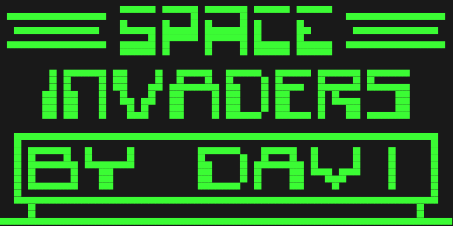

# Silicon8

Silicon8 is an implementation of a runtime for Chip-8, SCHIP and XO-Chip in Go
that can be used in Go projects or it can be compiled to WebAssembly so it can
run in your web browser (or anywhere WebAssembly can run).

To try it running in your browser, visit https://timendus.github.io/silicon8/
and load a CHIP-8 ROM file.

Please note that it is not perfect, and you may run into some bugs. Especially when the auto-detection fails to detect SCHIP and XO-CHIP programs. More about that [below](#august-2021).

This is my first experiment with both WebAssembly and Go. So I'll probably look
back on this repository with shame in a very short amount of time 😉 But that's
the point of this, this is a learning project for me.

## Development log

### March 2021

It's still missing a couple of features and instructions, and I'm sure there's
still a few problems here and there on the Chip interpretation side of things.
But most of the hard WASM/Go/JavaScript boundary related stuff is done.

The interpreter currently builds and runs as WebAssembly on NodeJS in the
terminal with `npm start`. You'll have to hard-code a file to load in `run.js`.
I'm still playing with a pure Go front-end, and the browser front-end is also
still a to do. But I can probably use this pretty much as a drop-in replacement
for my existing [web based Chip-8 play thing](https://github.com/Timendus/chip-8).

We'll see where this goes 😄

### July 2021

Alright, having a couple of days off, it's time to finish(?) this project 😉

First, I added the ability to provide it with a CHIP-8 binary of your choice as
a command line parameter. Having to hard-code the ROM has annoyed me for a
while.

Second, it was time to start finding the interpretation issues that were still
present, so I decided to start writing some automated tests. After about a week
of writing tests and fixing bugs here and there, on and off, I think I now feel
kind of safe saying that the interpreter works as it should for CHIP-8.



Also, I added a web-based front-end for the interpreter that works nicer and
looks better than the console based version.

Next up: Time to work on the SCHIP and XOCHIP features some more 😄

### August 2021

SCHIP high resolution mode works. Most instructions have been implemented (not
all have been tested) except for the 16 by 16 pixel sprites and XO-CHIP's four
colour mode. I'm going to refactor stuff a bit before I fix those, because I
intend to just hand the external runtime a colour bitmap to render from the
(WebAssembly) Go package. That should make it easier to implement a runtime and
allows for a fancy 16-colour mode. In theory. We'll see 😄

I added an auto-detect mode that tries to determine the version of CHIP-8 used
at runtime. I figured that programs that use specific instructions or access
memory outside of the regular limits can be safely bumped to SCHIP or XO-CHIP.
The feature works, but the number of programs that are accurately auto-detected
is lower than I expected. A program can use none of the SCHIP features, and
still expect to be run on SCHIP with all the quirks of that platform, for
example. Same with developers writing programs for XO-CHIP without actually
using anything beyond CHIP-8 and SCHIP instructions. No way to tell from just
the binary.

### Second half of August 2021

After doing a pretty big refactor, the host environment now just has to call the
`clockTick` function 60 times per second, and it will get a callback with the
new image to display when the screen has been updated. This is a much cleaner
solution that doesn't require as much knowledge of the interpreter internals on
the host side.

Also, as mentioned above, the image that the host environment receives is now a
colour image (three bytes per pixel), which has allowed me to more easily
implement XO-CHIPs four colour mode. Beyond that, I added the option to draw 16
colours to the screen using four planes. [John
Earnest](https://github.com/JohnEarnest) mentions this posibility in [his
proposal for XO-CHIP](https://github.com/JohnEarnest/Octo/blob/gh-pages/docs/XO-ChipSpecification.md),
but Octo doesn't implement it:

> Encoding is chosen such that it would be possible to provide 4 bitplanes (and
> thus 16 colors!) in the future should it prove necessary.

Although I'm not quire sure I would call it necessary, it's certainly cool.


To properly test all the display stuff I added two expectations to Jest that
allow me to capture the contents of the display in a BMP file, and then test
against that file. This allows for easy and quick visual inspection to see if
the test results in the right image, and to be alerted when anything breaks
that.

Finally, I made ["Pixel Studio"](https://timendus.github.io/silicon8/pixel-studio/)
to convert images to sprite data in a what-you-see-is-what-you-get type of way.
It supports one through four planes of colour, all possible sprite sizes and
optional dithering.

### November 2021

Just a few small changes. So far at least.

Having recently discovered the existence of the [Gamepad
API](https://developer.mozilla.org/en-US/docs/Web/API/Gamepad_API/Using_the_Gamepad_API)
I figured I should add gamepad support to Silicon8. It's a pretty simple API and
the code wasn't that complicated, but for some reason I'm not seeing my gamepad
in any browser other than Safari. That may have to do with my gamepad, but it is
pretty weird. Anyway, it works fine in Safari, and it "should work" for other
browsers too, I guess. To use it, open Silicon8, connect your gamepad if it
isn't already connected and press a button on it. Silicon8 should give you a
notification that it found your gamepad.

Next, I moved the fonts from the host environment to the Go module, so host
environments don't have to bother with that mess. This is something I had been
planning on doing for a long time, because it makes moving the interpreter to
other platforms easier, which is something I kinda plan on doing 👌🏻

Then, [Kouzeru](https://github.com/Kouzeru) reached out to me, and urged me to
implement the new XO-Chip opcode `pitch` in Silicon8. When I admitted to him
that the prerequisite opcode `audio` wasn't even working, he immediately offered
his support. Step one was just making the `audio` pattern and the `pitch`
available to the host environment. Then I had to turn those two into a sound
that makes sense. The
[specification](https://github.com/JohnEarnest/Octo/blob/gh-pages/docs/XO-ChipSpecification.md#audio)
is vague to say the least and the [implementation in
Octo](https://github.com/JohnEarnest/Octo/blob/77fc843d9f44a45ebb0cbd9f3ea2ec14caba4851/js/shared.js#L198)
kinda went over my head. But with a snippet of FFT code from Kouzeru, some
patient explanations and some experimentation I managed to get it working. So
now Silicon8 finally has XO-Chip sound support! 😄

The only question that remains is: should all this frequency calculation magic
be in the host environment, or should it really be moved to the Go module? And
it so, what exactly does the module pass to the host? I'm not sure. We'll see.

Finally, I added an overlay that allows the user to select the compatibility
type and execution speed of the interpreter. I was really hoping the
auto-detection would be enough, but it clearly isn't. Also, only being able to
set the execution speed "blind" with the -/+ keys was not to my liking.

A big thanks to @MinThaMi for fixing a nasty CSS issue with Safari 🎉

## Developer instructions

### How to run

In the console, using NodeJS:

```bash
git clone git@github.com:Timendus/silicon8.git
cd silicon8
./run.js ./tests/abc.ch8 # Should run the interpreter with a given CHIP-8 binary
```

Key `Q` or `Ctrl+C` exits the interpreter.

### How to serve the website

```bash
npm install
npm run serve # Should serve the web version on localhost:8080
```

### How to build

```bash
brew install tinygo # Or use your own favourite package manager
npm run build # Should rebuild the WebAssembly Go module
```

### How to test

```bash
npm install
npm test # Should run the tests
```
