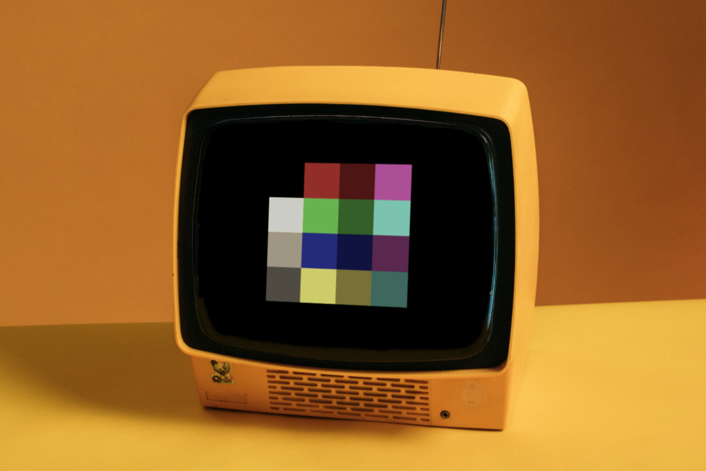

_This is still very much a work in progress. It makes very little sense in its
current form ;)_

# XO-CHIP colour proposal

[John Earnest](https://github.com/JohnEarnest) mentions in [his proposal
for XO-CHIP](https://github.com/JohnEarnest/Octo/blob/gh-pages/docs/XO-ChipSpecification.md)
that a theoretical sixteen colours are possible with the `plane` opcode:

> Encoding is chosen such that it would be possible to provide 4 bitplanes (and
> thus 16 colors!) in the future should it prove necessary.

However, Octo doesn't implement this theoretical 16-colour feature, and it seems
to have been left as an exercise to the reader. This document proposes a
concrete specification for the possible colours in XO-CHIP's two additional
planes.

## Constraints

### Memory

Octo has chosen to make the four colours that it does have configurable.
Considering the program size contraints of 3.5K / 32K this makes sense; adding
the other two bits of colour doubles the size of all image data in your program.
But still, programmatically having more colours opens up possibilities that four
configurable colours just don't provide, like showing a colourful Mandelbrot
set, using colour to indicate different players or enemies, et cetera.

Also, it would be possible to still use two planes, but two _different_ planes
for some sprites, effectively giving those sprites access to a different colour
palette without sacrificing storage space. This means that the colour palette
that we choose should preferably be "useful" when using one, two, three or four
bits of colour, in any `plane` permutation.

Things I consider "useful" would for example be:
  * Being able to switch palettes to re-use the same sprite for different
purposes (the red player and the blue player, the green goblin and the brown
goblin)
  * Having more vivid colours in another plane than more dull colours. Combined
with screen scolling, this allows for a brighter "foreground" and a more subdued
"background" that can scroll independently
  * The same goes for having a game world with a palette in "earthy" colours
with more vivid sprites for entities (players, enemies, pickups)

### Compatible colours

I thought it valuable for developers implementing this proposal to keep the
least significant plane compatible with standard CHIP-8, which means that in
`plane 1`, `0` indicates a non-active pixel (dark) and `1` an active pixel
(light).

Compatibility with Octo's implementation of XO-CHIP is kind of impossible,
because due to its configurability different values in `plane 3` don't really
correspond to fixed colours. However, we can take a look at the default colours
Octo uses:

| Bits | Colour                                                                  |
|------|-------------------------------------------------------------------------|
| 0b00 |  #996600 |
| 0b01 |  #FFCC00 |
| 0b10 |  #FF6600 |
| 0b11 |  #662200 |

As you can see these are fairly warm colours on a spectrum from lighter to
darker. We can try to stay compatible with these colours by trying to select
colours on a similar spectrum, or by selecting equally warm colours.
